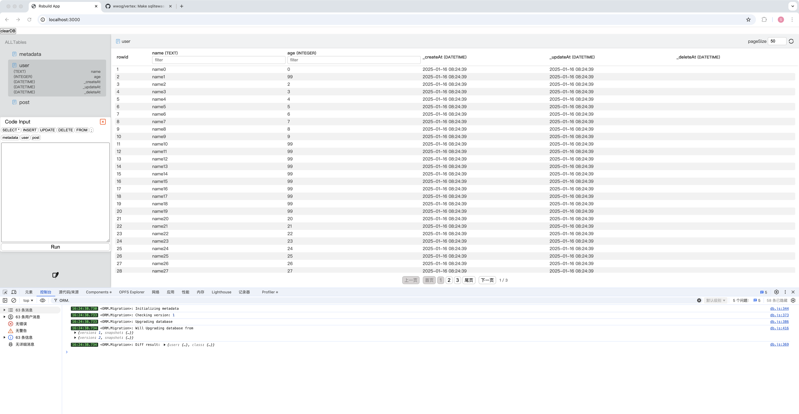
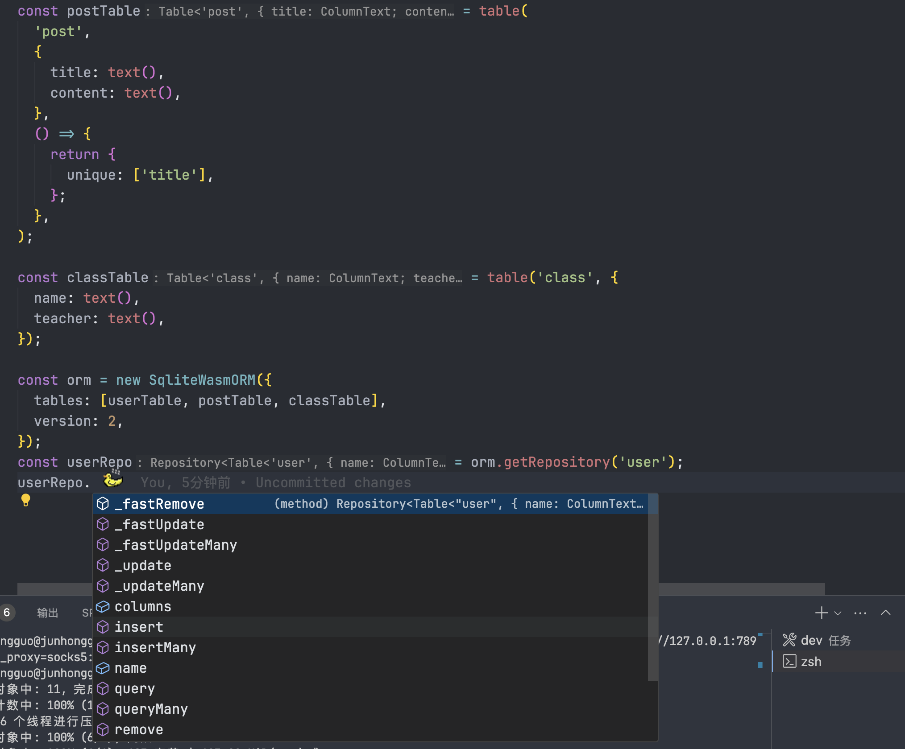

开发80%，实现主体功能

> SqlView

> ORM

# SqliteWasmORM

1. `Repository` Table操作
2. `Table` 模型
3. `Migration` 数据库迁移(升级，校验) [40%]
4. 内置操普通操作和快速操作

# Opfs

1. 支持了路径
2. 按nodejs的fs模块实现的文件操作
3. 封装了简化的opfs操作类模块

# SqlView

1. 支持查看SqliteWasm的数据库
2. 查看表结构
3. 分页查看表记录
4. 部分类型的筛选
5. Sql执行器

# Logger

1.解决了打印日志无法定位代码的问题2.支持日志scope 3.支持日志级别4.支持日志输出到非控制台(需要扩展)

# Elect - 执行者选举架构

使用场景：需要一个执行者来执行任务时。例如：多tab页签,多worker线程,多进程等。

## 功能描述:

现由多tab下多次链接数据库导致错误而设计，由唯一运行环境创建(现实现在SharedWorker中)`Scheduler`。`Scheduler`负责连同各个组件。
`council`理事会负责选举制度，`eventQueue`事件队列负责事件的派发，确保任务不会遗漏,`tabManager`负责tab页签的管理。
`Scheduler`负责调度选举，消息分发，事件派发。

在多tab需要一个唯一的依赖时，可以对接当页面变更为`Leader`时，创建各种任务。详情看`Node`实现。

## 功能实现列表：

### 通信：

- [x] 请求透过中心调度器调度提供者响应

> 请求被定义为调用者请求功能提供者, a -> scheduler -> b
>
> 响应被定义为调用者请求后调度器转发提供者后再次转发回调用者 b-> scheduler ->a

- [x] 调度器通知
- [x] 调度器广播
- [x] 消息类型和消息体的规范定义

### 选举制度:

> 由理事会"council"来管理选举制度，理事会由调度器"Scheduler"来管理。

- [x] 上位机制
  - [x] 第一人上位
  - [x] 退位后顺位继承
  - [x] 无leader时且无参选人时(选举成功会清空参选人)，由上层调度器指派leader
- [x] 参选机制
  - [x] 调用参选接口参选(上层定义为，可见时和实例化后参选)
- [x] 退位机制
  - [x] leader主动退位(上层定义为，页面关闭)
  - [x] 任期结束(上层定义为，其他页面激活开始任期倒计时，具体查看`council.TermOfOffice`)

### 事件队列：

- [x] 批量激活
- [x] 重载事件队列

## 考虑优化项:

- [x] 批量处理 事件队列统一派发给leader。
- [x] server单一化，而不是每个client都会创建一个server。
- [] 现行策略A->Scheduler->B , B->Scheduler->A,会存在多次序列化，并且如果数据体会有4次耗时的克隆和序列化的操作。
  - 考虑优化成A->Scheduler->B , B->A->Scheduler,B->A 使用ShardBuffer，减少序列化和克隆的操作以及通信成本
